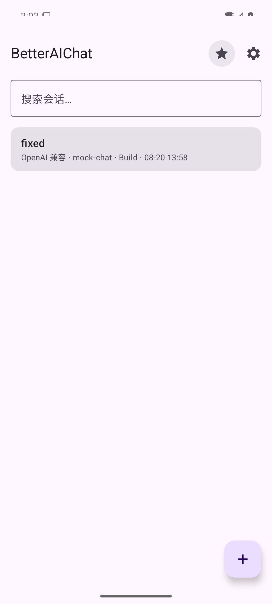
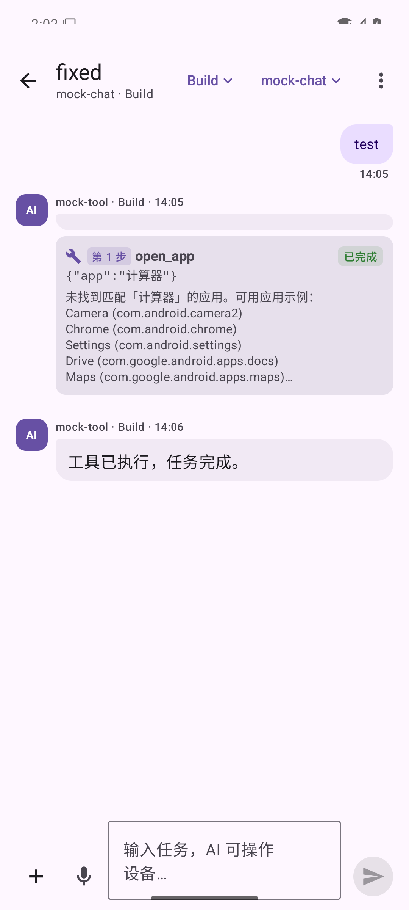
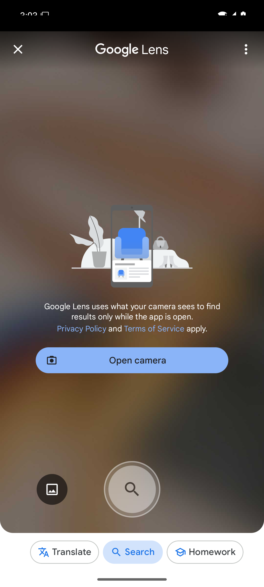

# BetterAIChat

> A native Android AI assistant that uses **your own API keys**. Chat with leading LLMs, and let the AI operate your phone — open apps, take screenshots, search the web, run shell commands, and follow reusable Skills.

Unlike mainstream AI apps, BetterAIChat is a **local-first agent**: your API keys are encrypted on-device, there is no cloud, and the AI can actually *do things* on your device through function calling.

---

## Screenshots

| Conversations | Chat | Settings |
| --- | --- | --- |
|  |  |  |

---

## Features

### Chat & models
- **Multiple providers**: OpenAI-compatible (OpenAI, DeepSeek, Moonshot, Qwen, Ollama, any gateway), Anthropic Claude, Google Gemini
- **Streaming replies** with Markdown rendering, thinking-process display (reasoning stream), blinking cursor
- **Model picker**: built-in catalog per provider + custom model IDs + one-tap server model fetch (`/v1/models`)
- **Context usage tracking** in the header (`117.3K (12%)`)
- **Context compression**: summarize long conversations to free the window
- **AI auto-titles** for conversations; prompt templates (translate / summarize / polish / write / explain code / brainstorm)

### Modes (opencode-style)
| Mode | Behavior |
| --- | --- |
| `Chat` | Pure conversation, no tools |
| `Plan` | Read-only analysis, write tools forbidden |
| `Build` | Default — every tool execution asks for confirmation |
| `Max` | Autonomous multi-step tool calls + deep reasoning (max effort / thinking) |

### The AI can operate your device
| Tool | What it does |
| --- | --- |
| `open_app` | Launch any installed app |
| `send_notification` | Post notifications |
| `set_brightness` / `set_volume` / `set_screen_timeout` | Adjust system settings |
| `set_flashlight` | Torch control |
| `take_screenshot` | Screen capture |
| `device_info` | Device / battery / storage info |
| `set_clipboard` / `get_clipboard` | Clipboard read & write |
| `set_alarm` | One-shot reminders |
| `schedule_repeat` | Daily / weekly / hourly repeating reminders (manageable in Settings → 定时任务) |
| `speak_text` | TTS read-aloud |
| `web_search` / `web_read` | Real-time web search (Bing + DuckDuckGo fallback) and page reading |
| `open_settings` | Jump to system settings pages |
| `run_shell` | **Root-level shell execution via Shizuku** (pm, am, dumpsys, files…) |

### Screen analysis — the AI can *see* your screen
One tap → screenshot → vision model describes what's on your screen and gives operation advice. Works with any vision-capable model.

### Skills (opencode-style)
- Import `SKILL.md` files with YAML frontmatter (`name`, `description`, `allowed-tools`)
- Skills can **define their own tools** with action types: `alarm`, `notification`, `clipboard`, `intent`, `settings` — including `{param}` templates
- **Record actions into skills**: after the AI completes a multi-step task, save the tool sequence as a reusable Skill
- Built-in action recorder, import/delete management

### Attachments & documents
- Images (up to 4, auto-compressed, EXIF-corrected) sent to vision models
- **PDF** (on-device Chinese OCR), **Word .docx**, **Excel .xlsx** (all sheets), text files up to 1MB

### Hands-free
- **Voice assistant mode**: AI speaks its reply, mic auto-opens, your spoken answer is sent automatically — a complete hands-free loop
- Voice input button, read-aloud for any message, auto read-aloud toggle

### Organization
- Multi-conversation management: pin, archive, search (title + full-text content), rename, swipe-to-delete, clear context
- Starred messages with a dedicated favorites page
- Export conversations as Markdown (share sheet)
- Long-press message actions: copy / speak / edit & resend / star / delete
- Usage stats (conversations, messages, tokens, tool calls)
- Themes: light / dark / system + 4 accent colors
- Share-into-chat (`ACTION_SEND`) and deep link `betteraichat://ask?text=…`

---

## Getting Started

### Download
Download the APK from [Releases](https://github.com/Verlintas/BetterAIChat/releases) — **in a browser**. The GitHub Android app corrupts large APK downloads; verify with the SHA-256 printed in each release, or use the smaller `-lite` build (8.8 MB, no OCR model).

### Configure
1. Settings → 服务商与模型 → pick a provider, enter your API key (encrypted locally), optionally a custom Base URL
2. Tap **测试连接并获取模型** — it verifies the connection and fetches the model list from your server
3. Choose a model and default mode, save
4. Start a conversation. In Build/Max modes, ask the AI to do things: *"打开计算器"*, *"每天 9 点提醒我喝水"*, *"搜索今天的新闻并总结"*…

### Build from source
```bash
# JDK 17 + Android SDK (compileSdk 36)
./gradlew assembleDebug
# APK: app/build/outputs/apk/debug/app-debug.apk
```

---

## Permissions

| Permission | Purpose |
| --- | --- |
| Notifications | AI notifications & reminders |
| Microphone | Voice input & voice assistant mode |
| Camera | Flashlight control |
| Modify system settings | Brightness / screen timeout |
| Screen capture | Screen analysis (Android 15: choose "Entire screen" during consent) |
| Shizuku (optional) | Root-level shell execution |

All permissions are granted manually; tools return clear errors when unauthorized.

---

## Tech Stack

Kotlin · Jetpack Compose (Material 3) · OkHttp (SSE) · kotlinx.serialization · Room · Android Keystore · ML Kit (Chinese OCR)

```
:app         UI (conversations, chat, settings, stats, starred)
:core        models, engine, SSE, storage, DB, skills parsing
:providers   OpenAI-compatible / Anthropic / Gemini adapters
:skills      device tools + tool registry + action executor
```

---

## Roadmap

- Multi-model comparison (one question, several models side by side)
- Home screen widget
- More device tools (Do-Not-Disturb, screen recording, notification reading)

---

## License

[MIT](LICENSE)
